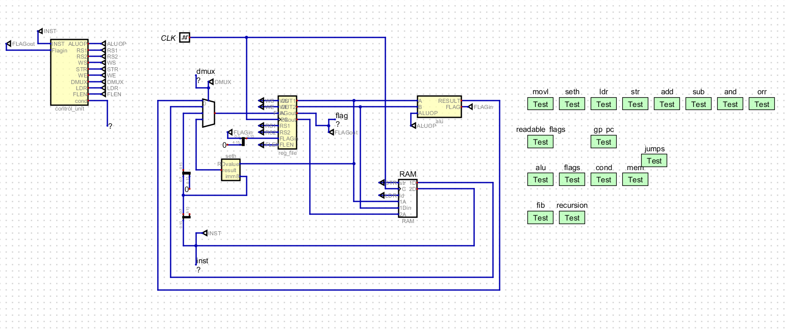
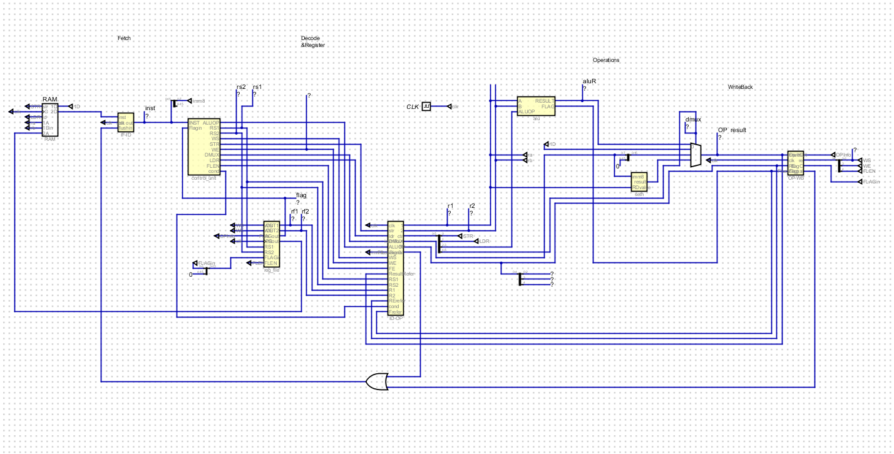

# Single-cycled and Pipe-lined CPU Simulators

Two CPU simulators, /single-cycle/CPU.dig and /pipelined/pipelinedCPU.dig

Concise documentation that describes their implementation and performance are written in the report.pdf

Open .dig file via Java GUI program upblished at https://github.com/hneemann/Digital.

Preview image for the single cycle cpu:

Preview image for the pipelined cpu:
